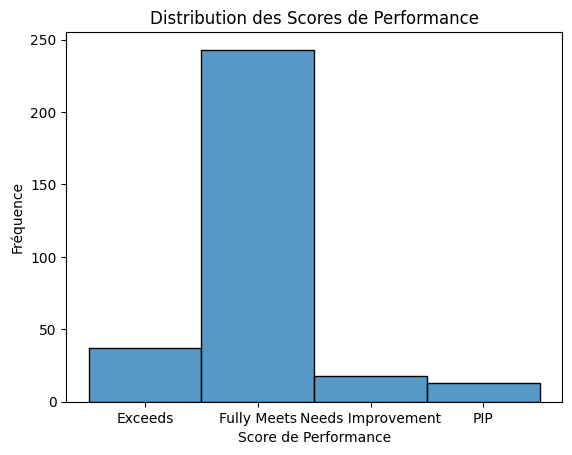
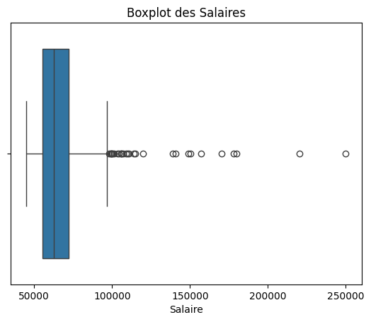
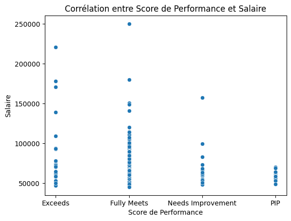
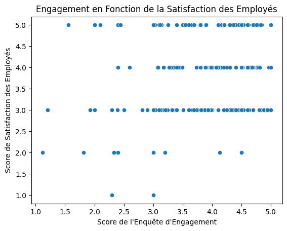

# Analyse des Données et Optimisation des Performances

## Contexte
Une entreprise souhaite analyser la répartition des performances des employés pour comprendre les écarts et identifier les outliers.

## Objectif
Étudier les distributions des scores de performance pour détecter les facteurs d'amélioration.

## Jeu de Données
Nous avons utilisé le jeu de données `HRDataset_v14.csv`, qui contient diverses informations sur les employés, notamment leur satisfaction, engagement, score de performance et salaire.

Les principales colonnes utilisées pour l'analyse:

EmpID : L'ID de l'employé. Utilisé comme identifiant unique pour chaque employé.

PerformanceScore : Le score de performance de l'employé. Principal indicateur utilisé pour analyser les performances des employés.

Absences : Le nombre d'absences de l'employé. Utilisé pour analyser l'impact des absences sur les performances.

Salary : Le salaire de l'employé. Peut être utilisé pour analyser s'il y a une corrélation entre le salaire et la performance.

DeptID : L'ID du département. Utilisé pour voir si certaines performances sont liées à des départements spécifiques.

EngagementSurvey : Le score de l'enquête d'engagement. Utilisé pour analyser la relation entre l'engagement et les performances.

EmpSatisfaction : Le niveau de satisfaction de l'employé. Utilisé pour étudier l'impact de la satisfaction sur les performances.

## Bibliothèques utilisées
```python
import pandas as pd 
import matplotlib.pyplot as plt
import seaborn as sns
```

## Analyses Réalisées
### 1. Vérification des valeurs manquantes
Aucune valeur manquante n’a été détectée dans les colonnes sélectionnées.

### 2. Statistiques descriptives
Nous avons analysé les tendances des performances, absences, salaires et satisfaction des employés. 

### 3. Visualisation des distributions
**Histogramme des scores de performance**


**Boxplot des salaires**


### 4. Relations entre variables
**Corrélation entre Score de Performance et Salaire**


**Engagement en fonction de la satisfaction**


## Recommandations
- **Optimiser la gestion des absences** : Les employés avec des absences élevées devraient être suivis pour comprendre les causes et limiter les impacts négatifs.
- **Réévaluer la politique salariale** : Il existe des écarts de salaires importants sans lien direct avec la performance. Une meilleure structure salariale pourrait renforcer la motivation.
- **Encourager l’engagement des employés** : Un engagement élevé est souvent associé à une plus grande satisfaction et meilleure performance. Des initiatives de bien-être au travail pourraient être bénéfiques.
- **Formation ciblée pour les employés sous-performants** : Offrir du mentorat ou des formations adaptées aux employés avec un score de performance faible pourrait améliorer leur contribution à l'entreprise.

## Conclusion
Grâce à cette analyse, nous avons mis en lumière des tendances et des points d’amélioration qui peuvent guider les décisions stratégiques de l’entreprise pour une meilleure performance globale.
**Renforcement Positif** pour les scores élevés.
**Formation et Développement** pour les scores moyens.
**Plan d'Amélioration de la Performance (PIP)** pour les scores faibles.
